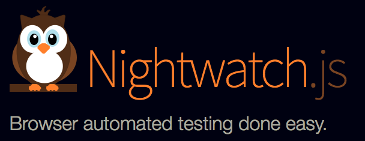
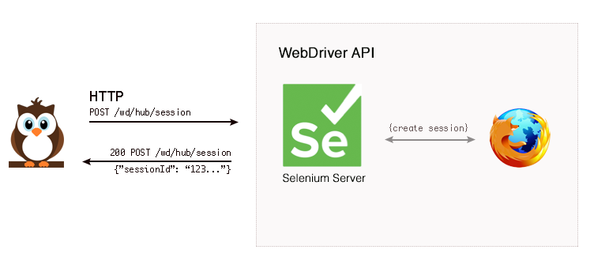

E2E Test
End-to-End Test
===

---

# E2E Test

소프트웨어가 처음부터 끝까지 설계한대로 수행하는지 테스트
실제 운영 시나리오를 실행해 검증
소프트웨어와 연동하는 시스템 및 데이터 처리 검증

---

# Nightwatch.js

브라우저 기반 소프트웨어를 위한 E2E 테스팅 솔루션
WebDriver API를 사용해 DOM 요소에 대한 명령 및 assertion을 수행

&nbsp;


---

# WebDriver

웹브라우저 자동화를 위한 범용라이브러리
웹브라우저를 원격으로 제어 가능
표준화를 목표로하는 W3C 스펙

Nightwatch는 WebDriver API를 사용해
창열기, 링크 클릭과 같은 브라우저 작업을 수행한다.



---

# Workspace

``` bash
$ cd path/to/workspace
$ mkdir nightwatch-test
$ cd nightwatch-test
$ npm init
```

---

# download

Selenium Standalone Server
http://www.seleniumhq.org/download/

&nbsp;
ChromeDriver - WebDriver for Chrome
https://sites.google.com/a/chromium.org/chromedriver/downloads

`nightwatch-test/bin` 디렉토리로 저장

---

# dependencies

``` bash
$ npm install validator --save
```

``` bash
$ npm install webpack webpack-dev-server --save-dev
$ npm install babel-core babel-loader babel-register babel-preset-env --save-dev
$ npm install nightwatch --save-dev
```

---

# webpack.config.js

``` js
const path = require("path");
module.exports = {
  entry: "./src/app.js",
  output: {
    path: path.resolve(__dirname, "dist"),
    filename: "bundle.js"
  },
  module: {
    rules: [
      {
        test: /\.js$/,
        exclude: /(node_modules|bower_components)/,
        use: {
          loader: "babel-loader"
        }
      }
    ]
  },
  devServer: {
    publicPath: "/dist/"
  },
};
```

---

# nightwtch.json

``` json
{
"src_folders" : ["tests"],
  "selenium" : {
    "start_process" : true,
    "server_path" : "./bin/selenium-server-standalone-3.4.0.jar",
    "cli_args" : {
      "webdriver.chrome.driver" : "./bin/chromedriver"
    }
  },

  "test_settings" : {
    "default" : {
      "launch_url" : "http://localhost",
      "desiredCapabilities": {
        "browserName": "chrome"
      }
    }
  }
}

```

---

# package.json

``` json
"scripts": {
  "start": "webpack-dev-server --open",
  "build": "webpack",
  "nightwtch": "nightwtch"
}
```

---

# src/index.html

``` html
<!doctype html>
<html lang="ko">
<head>
<meta charset="utf-8">
<meta http-equiv="x-ua-compatible" content="ie=edge">
<title>e2e test</title>
<meta name="viewport" content="width=device-width, initial-scale=1">
<link rel="stylesheet" href="https://maxcdn.bootstrapcdn.com/bootstrap/3.3.7/css/bootstrap.min.css">
</head>
<body>
<div class="container">
  <div class="row">
    <div class="jumbotron">
      <h1>Hello E2E!</h1>
    </div>
```

---

``` html
    <div>
      <form>
        <div class="form-group">
          <label for="exampleInputEmail1">Email address</label>
          <input type="email" class="form-control" id="exampleInputEmail1" placeholder="Email">
        </div>
        <div class="form-group">
          <label for="exampleInputPassword1">Password</label>
          <input type="password" class="form-control" id="exampleInputPassword1" placeholder="Password">
        </div>
        <div class="checkbox">
          <label>
            <input type="checkbox"> Check me out
          </label>
        </div>
        <button type="submit" class="btn btn-default">Submit</button>
      </form>
    </div>
  </div>
</div>
<script src="dist/bundle.js"></script>
</body>
</html>
```

---

# src/app.js

``` js
import LoginController from "./login.controller";

new LoginController();
```

---

# src/login.controller.js

``` js
import validator from "validator";

class LoginController {
  constructor() {
    this.email = document.getElementById("email");
    this.email.addEventListener("blur", this.onBlurEmail.bind(this));
  }
```
----

``` js
  onBlurEmail() {
    let validation = false;
    const email = this.email.value;

    if (!validator.isEmpty(email)) {
      validation = validator.isEmail(email);
    }

    this.toggleErrorClass(this.email, validation);
  }

  toggleErrorClass(el, validation) {
    if (!validation) {
      el.parentNode.classList.add("has-error");
    } else {
      el.parentNode.classList.remove("has-error");
    }
  }
}
```

---

# tests/login.test.js

``` js
this.loginTest = function(browser) {
  browser
    .url("http://localhost:8080/")
    .waitForElementVisible("body", 1000)
    .setValue("#email", "kishu#navercorp.com")
    .click("#password")
    .assert.cssClassPresent("form > .form-group:nth-child(1)", "has-error")
    .setValue("#email", "kishu@navercorp.com")
    .click("#password")
    .assert.cssClassNotPresent("form > .form-group:nth-child(1)", "has-error")
    .end();
};
```

---

# run nightwatch

``` bash
$ npm run nightwatch
```